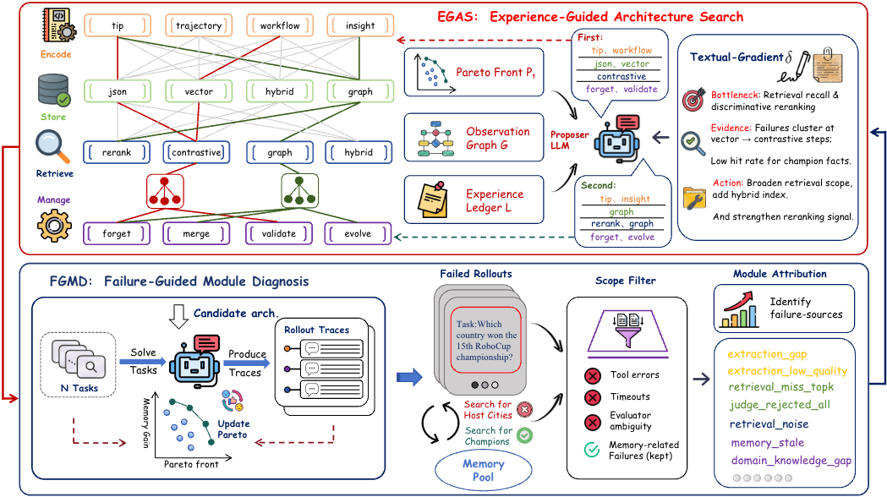

<div align="center">
  
  <h1 align="center">AutoMem: Text-Gradient Evolution of LLM-Agent Memory Architectures</h1>
</div>

<p align="center">
  English | <a href="README_CN.md">简体中文</a>
</p>

## Introduction

Long-term memory design for LLM agents is a coupled architecture problem: what to
**Encode**, how to **Store** it, how to **Retrieve** it, and how to **Manage** it
interact, and the best combination changes with the task distribution. AutoMem
turns this into a search problem over an explicit, factored architecture space and
solves it with a text-gradient recursive self-improvement loop built from two
components (see the figure above):

- **EGAS — Experience-Guided Architecture Search.** A proposer LLM generates
  candidate architectures each round, conditioned on the Pareto front, an
  observation graph of past rollouts, and an experience ledger of validated
  principles and dead ends. Textual gradients (bottleneck → evidence → action)
  steer the next proposal instead of blind mutation.
- **FGMD — Failure-Guided Module Diagnosis.** Each candidate's failed rollouts
  pass a scope filter (tool errors, timeouts, and judge ambiguity are excluded)
  and the remaining memory-related failures are attributed to specific modules
  (`extraction_gap`, `retrieval_miss_topk`, `retrieval_noise`, `memory_stale`, …),
  producing targeted feedback for the next round.

Every architecture runs under a fixed, code-defined memory-use runtime
(`automem-runtime-v1`: one context-composition call with cited guidance, a
BEGIN-plus-one-refresh lifecycle, and literal-preserving query planning), so
search never rewards hidden execution-policy changes. See
[docs/architecture.md](docs/architecture.md).

## Architecture Space

The public space `automem-esrm-v1` — 31 × 5 × 6 × 4 = 3720 combinations before
compatibility validation, of which 2573 are valid:

| Coordinate | Options |
| --- | --- |
| Encode — non-empty subset (31) | `tip`, `insight`, `trajectory`, `workflow`, `shortcut` |
| Store (5) | `json`, `vector`, `hybrid`, `graph`, `llm_graph` |
| Retrieve (6) | `hybrid`, `contrastive`, `cbr_rerank`, `graph`, `hyde`, `mmr` |
| Manage (4) | `lightweight`, `json_full`, `tool_manager`, `graph_consolidate` |

Every selected encode type is persisted to the one selected store. `graph`
retrieval requires a graph-family store; `graph_consolidate` additionally
requires the `graph` retriever. Multi-encode routes such as
`tip+trajectory+workflow` are first-class (see
[configs/example.architecture.json](configs/example.architecture.json)).

## 🚀 Quick Start

### 1. Install

```bash
python -m venv .venv
source .venv/bin/activate
python -m pip install -e ".[dev,benchmarks]"
```

### 2. Verify offline (no API keys needed)

```bash
automem space          # print the public space and compatibility counts
automem smoke          # offline architecture / storage / retrieval / runtime checks
pytest -m "not online" # full offline test suite
```

### 3. Run a synthetic evolution round (offline, no cost)

```bash
python -m automem.search.engine \
  --run_name evolution-smoke --output_dir "$(mktemp -d)" \
  --infile examples/smoke_tasks.jsonl \
  --max_rounds 2 --num_candidates 3 \
  --warmup_n 1 --search_n 4 --batch_size 2 --validation_n 1 --test_n 1 \
  --dry_run --no_ledger
```

### 4. Run a real architecture search (needs credentials + dataset)

Copy `.env.example` to `.env` and fill in the service credentials you use
(`OPENAI_API_KEY`/`OPENAI_API_BASE`, `SERPER_API_KEY`, …). Obtain benchmark data
from its official source, then:

```bash
python -m automem.search.engine \
  --run_name gaia-search --output_dir runs/search \
  --infile data/gaia/metadata.jsonl --benchmark GAIA \
  --model TASK_MODEL --search_model SEARCH_MODEL \
  --judge_model JUDGE_MODEL --diagnosis_model DIAGNOSIS_MODEL \
  --max_rounds 8 --num_candidates 3 \
  --warmup_n 19 --search_n 100 --batch_size 50 --validation_n 30 --test_n 15 \
  --final_validation
```

`--benchmark` also accepts `WebWalkerQA` and `xBench-DeepSearch`. A single
benchmark run without search is available through each runner, e.g.:

```bash
python -m automem.benchmarks.gaia.runner \
  --infile data/gaia/metadata.jsonl --model TASK_MODEL --judge_model JUDGE_MODEL \
  --memory_provider modular --enable_memory_evolution
```

See [docs/reproduction.md](docs/reproduction.md) for dataset field contracts and
per-benchmark defaults.

## Repository Layout

```text
src/automem/architecture/   Public schema, compatibility rules, compiler
src/automem/providers/      Memory extraction and provider lifecycle
src/automem/storage/        JSON, vector, hybrid, and graph-family stores
src/automem/retrieval/      Retrieval implementations
src/automem/management/     Lifecycle operations and four public presets
src/automem/runtime/        Fixed memory-use execution policy
src/automem/search/         EGAS/FGMD search loop, diagnosis, selection
src/automem/benchmarks/     GAIA, WebWalkerQA, and xBench-DeepSearch runners
src/automem/prompts/        Installed prompt resources
src/flashoagents/           Modified agent runtime used by benchmark runners
tests/                      Offline unit, integration, and smoke tests
```

The repository ships source, prompts, and offline tests only — no datasets,
credentials, baselines, or result artifacts.

## Documentation

- [Architecture](docs/architecture.md) — space, constraints, fixed runtime
- [Configuration](docs/configuration.md) — the `ArchitectureSpec` contract
- [Reproduction](docs/reproduction.md) — run commands and dataset contracts
- [Contributing](CONTRIBUTING.md) · [Security](SECURITY.md)

## Citation and License

Citation metadata is in [CITATION.cff](CITATION.cff). AutoMem is licensed under
Apache-2.0; modified third-party runtime source retains its file-level headers
(see [THIRD_PARTY_NOTICES.md](THIRD_PARTY_NOTICES.md)). Questions and issues are
welcome on the GitHub issue tracker.
